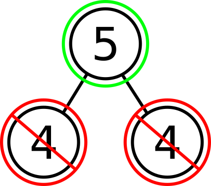
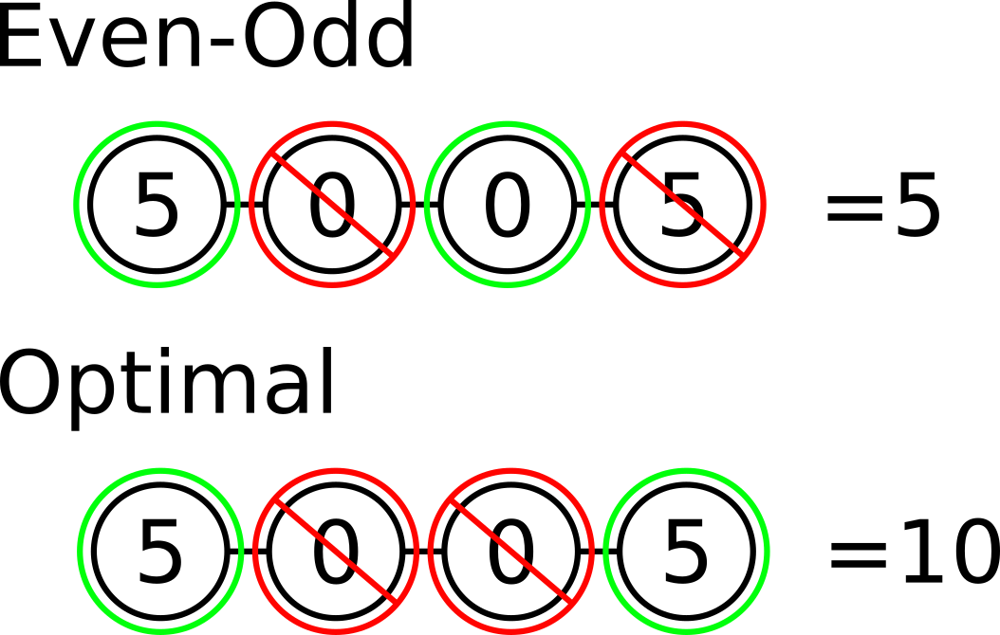

# Question 1

## Heaviest-First

\


In the above diagram, the vertex with the heaviest weight of 5 is picked, and the
two adjacent vertices with weights 4 are discarded. This is not the maximum
independent set, since the sum is 5, instead of the set picking just the bottom
two vertices with sum 8.

## Even-Odd

\


The above diagram clearly shows that Even-Odd doesn't work.

## One that does work

We can solve this using dynamic programming.  We can transform the path into an
array of $n$ values with one representing the weight of every node.

```javascript
w = array of weights for all vertices
n = number of vertices

lookupTable = {}

function solve(i) {
  if (i >= n) {
    return 0, [];
  }
  cached = lookupTable[i]
  if (cached) {
    return cached
  }

  takeVal, takeVertices = solve(i+2)
  takeVal += w(i)
  takeVertices += [i]

  dontTakeVal, dontTakeVertices = solve(i+1)

  if (takeVal > dontTakeVal) {
    val = takeVal
    vertices = takeVertices
  } else {
    val = dontTakeVal
    vertices = dontTakeVertices
  }

  lookupTable[i] = (val, vertices)
  return val, vertices
}
```

This runs in $O(n)$ since there are $n$ entries in the `lookupTable` and solve
takes a constant amount of time in each iteration.
